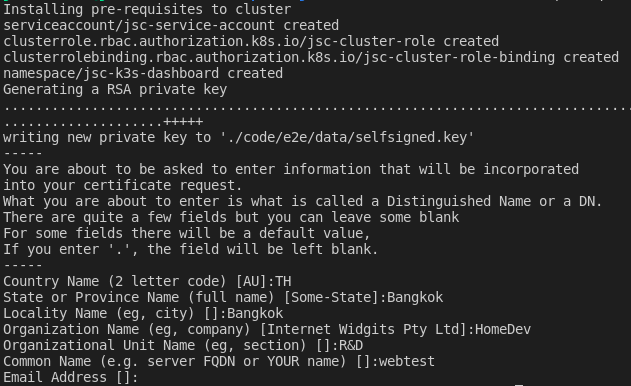

# JSC Poor man's Kubernetes Dashboard

Initially tested on [Rancher's k3s](https://rancher.com/products/k3s), which includes by default the metrics services. It should work on any kubernetes implementation, but you might have to add the metrics services if they are not already there.

---
## Getting Started

### Dependencies

Currently the only OS supported is Linux. You need a running docker installation, with `docker-compose` and also `openssl` and `kubectl` commands available.

The first time, setup the environment variables:
```
make prerequisites env MAIN_NODE_IP=<IP of main node> DOCKER_ID=<docker id> SERVICE_IP=<IP of service>
```
Where:
- `<IP of main node>` is the IP of your cluster main node.
- `<docker id>` is the id of your docker repository (not the email address). It is used to create the name of the docker image.
- `<IP of service>` is the IP address to bind the dashboard application. It should be one of your node IP address.

This will create the self-signed SSL certificates for the test. You'll need to fill in some information, make sure you use `webtest` for the `Common Name` questions.

  


---
## Development

Simply run:
```
make dev
```

You can then browse to http://0.0.0.0:3000
The application was created using the `create-next-app`, in development mode it has hot redeploy.

You can run
```
make stop
```
when done to avoid leaving containers running.

---
## Testing

You can run 2 types of tests: unit tests or UI tests:
```
make unit-tests
make ui-tests
```

---
## Production

You can deploy this code on your cluster so it will self monitor the metrics. 

### Pre-requisites

You need to login from the command line to the docker registry:
```
docker login
```

This is necessary for your cluster to pull the image we will push there.

### New cluster

When using the application for the first time on a cluster, you need to create the service account to access the cluster.  
Have your cluster up and running, then run the following command:
```
make setup-prod
```

You should end-up with an output like this:
  


If everything went well, you can then install the dependencies on your cluster:
```
make first-deploy
```
This will build the images again but since they are unchanged it should be quick. The output should be something like:


You should be able to browse to http://&lt;SERVICE_IP&gt;:8080 and see the dashboard:


### Deployment

Afterwards, you can build and deploy:
```
make build deploy
```

You can then browse to http://&lt;service IP&gt;:8080

You can combine a build and deploy by adding the main node IP address to the deploy command:
```
make deploy DOCKER_ID=<docker id>
```
Where:
- `<docker id>` is the id of your docker repository (not the email address). It is used to create the name of the docker image.

---
## Testing

See [testing.md](./doc/testing.md)